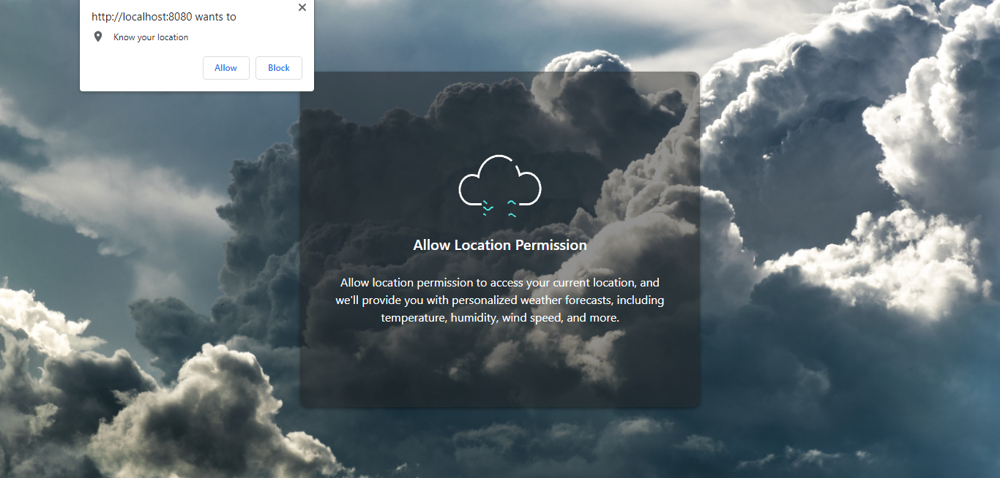
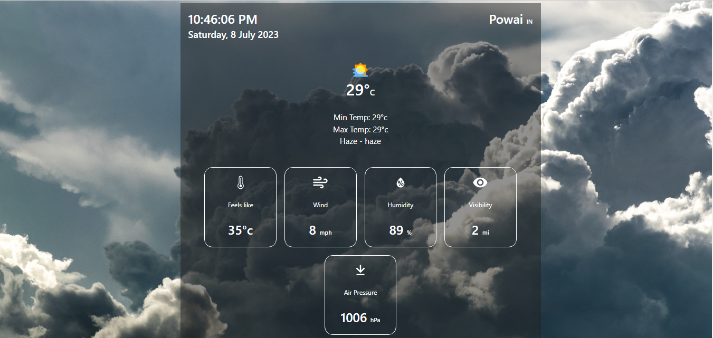

# Weather App

I have developed a weather web application using React. When you visit the website, it will prompt you to allow location permission. This permission is requested so that we can access your current location and provide you with personalized weather forecasts.

Once you grant the location permission, the application will display the weather information for your current location. You will be able to see details such as temperature, humidity, wind speed, and more.

In addition to the current location weather, you can also search for weather information of other places by entering the city name. The application uses the weather API from the website openweathermap.org to fetch the weather data for different locations.

website - https://openweathermap.org/api

By combining the use of location permission and the weather API, the application aims to deliver real-time and accurate weather information tailored to your location. It provides convenience and the ability to stay updated on weather conditions both locally and for other places of interest.

